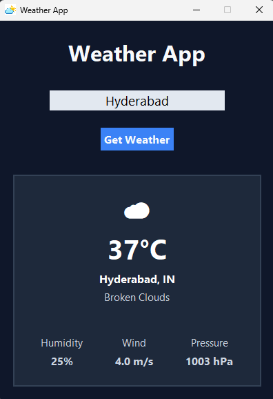

# Weather App

A desktop weather application built using Python, Tkinter, and the OpenWeather API to display real-time weather data for any city.

---

## Screenshot



---

## Features

* Search weather by city name
* Real-time weather data using OpenWeather API
* User-friendly GUI built with Tkinter
* Displays:

  * Temperature
  * Weather Condition
  * Weather Description
  * Humidity
  * Wind Speed
  * Atmospheric Pressure
* Input validation
* Error handling for:

  * Invalid city names
  * Invalid API keys
  * Network issues
  * API rate limits

---

## Technologies Used

* Python
* Tkinter
* Requests
* Python Dotenv
* OpenWeather API

---

## Installation

### 1. Clone the Repository

```bash
git clone https://github.com/SaadAhmedCodeX/Weather-App.git

cd Weather-App
```

---

### 2. Create a Virtual Environment

```bash
python -m venv .venv
```

---

### 3. Activate the Virtual Environment

#### Windows PowerShell

```bash
.venv\Scripts\Activate.ps1
```

#### Windows Command Prompt

```bash
.venv\Scripts\activate.bat
```

---

### 4. Install Required Packages

```bash
pip install -r requirements.txt
```

---

## Setting Up OpenWeather API

This project uses the OpenWeather API to fetch weather information.

### Step 1: Create an OpenWeather Account

Visit:

https://openweathermap.org

Create a free account and verify your email address.

---

### Step 2: Generate an API Key

After logging in:

1. Go to your account dashboard.
2. Navigate to **My API Keys**.
3. Generate a new API key.
4. Copy the generated key.

> Note: Newly generated API keys may take a few minutes to become active.

---

### Step 3: Create a .env File

Inside the project folder, create a file named:

```text
.env
```

Add the following:

```env
API_KEY=your_openweather_api_key_here
```

Replace:

```text
your_openweather_api_key_here
```

with your actual API key.

Example:

```env
API_KEY=1234567890abcdef1234567890abcdef
```

---

## Running the Application

Once everything is set up:

```bash
python main.py
```

The Weather App window should open.

Enter a city name and click **Get Weather** or press **Enter**.

---

## Project Structure

```text
Weather-App/
│
├── main.py
├── logo.png
├── requirements.txt
├── README.md
├── .gitignore
└── .env
```

### Note

The `.env` file is not included in the repository and must be created manually by the user.